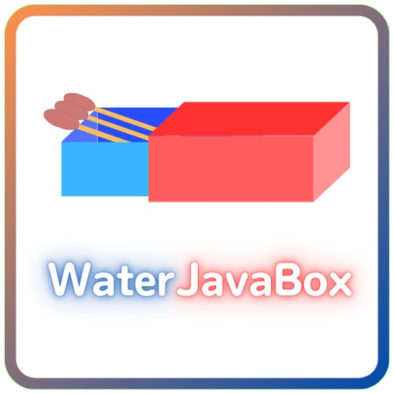

  
  <h1>
    WaterJavaBox 
  </h1>

  <h3>
    將AI加速踩死的人工智慧開發團隊 
    主要以大語言模型為研究
  </h3>

  
  <h4>

  >   我們的願景是打造一個 "夥伴" 而非 "工具"  
  >   是一個會主動、隨時問你說，有需要幫助嗎? 並且協助你  
  >   就像是一個真人一樣，他就活在你的旁邊，成為你的朋友。 

  </h4>

 

## 💻 主要成員使用語言
### [Calou](https://github.com/YQ-Calou)
- Nodejs (ES6 and CommandJS)
- Python
- HTML
- CSS
- Javascript

### [Javaowo](https://github.com/javaowo)
- Python

### [Katsuru](https://github.com/HM-Lay)
- Javascript
- Nodejs (CommandJS)

## ☎️ 聯絡我們
- Gmail (Calou) : chou.addison@gmail.com

## ⛔ 不接受
1. ✒️翻譯請求
2. 🔧新功能要求
3. 🚮垃圾郵件
